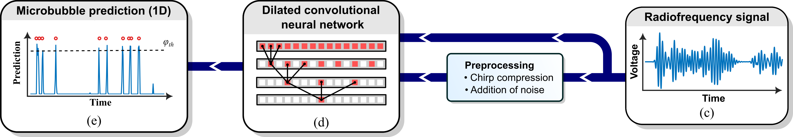

# Neural network training and evaluation

## Neural network architecture

The network architecture is described in Section IID of the article.

**Fig. 2. Super-localization pipeline.** *The RF signal (c) is being fed into the dilated CNN (d). The CNN architecture consists of a 1D reflection padding layer, 1D convolutional layers, batch normalization layers and Rectified Linear Unit (ReLU) activation layers. The model predicts the presence of a microbubble on every grid point in the RF signal (e). More information on the network parameters, such as dilation rate and dual-loss function can be found in [1]. *

The neural network is implemented in `bubblenetwork.py`.

## Neural network training
The dual-loss function is adapted from [1] and implemented in `bubblelossfunctions.py`. The training procedure is described in Section IID of the article.

Network training is implemented in `networkTraining.py`. Training is initiated in a command window by navigating to this directory and running: `python networkTraining.py {PULSE_NAME} {NOISE_OPTION}`, where:
* `{PULSE_NAME}` is the name of the pulse, e.g., `pulseSingle_Reference_OneCycle`.
* `{NOISE_OPTIONS}` indicates whether the networks need to be trained on noise. Enter `--noise` to initiate training on the provided noise levels.

The weights of the neural networks during training are stored in the folder:
* 📂`Results\\Networks\\model_{PULSE_NAME}`.

Networks are trained on the characterized waveforms `{PULSE_NAME}`:
* Ref:   `pulseSingle_Reference_OneCycle`
* s1.7:  `pulseSingle_Short_LowF`
* S2.5:  `pulseSingle_Short_MedF`
* S3.4:  `pulseSingle_Short_HighF`
* L1.7:  `pulseSingle_Long_LowF`
* L2.5:  `pulseSingle_Long_MedF`
* L3.4:  `pulseSingle_Long_HighF`
* SUC:   `pulseChirp_Short_Upsweep`
* SDC:   `pulseChirp_Short_Downsweep`
* LUC:   `pulseChirp_Long_Upsweep`
* LDC:   `pulseChirp_Long_Downsweep`
* DPT:   `pulseTrain_Short_Delay`

Additionally, `model_{PULSE_NAME}` can have several postpositions indicating specific characteristics of the trained network: 
* `_noise#` denotes that the network is trained with Gaussian noise level #.
* `_compressed` denotes that the network is trained on compressed signals.
* `_linear` denotes that the network is trained on RF signals generated with a linearized RP-solver.

## Addition of noise
The addition of noise is implemented in `addNoise.py`. Noise level # is expressed in a fraction of reference noise level $U_{ref}$.

## Model evaluation
We evaluate the performance of the models with the F1 score as described in Section IIE of the article. The F1 score is the harmonic mean of the precision and the recall:

$$
    F_1 = \mathrm{\frac{2 \times Precision \times Recall}{Precision + Recall}}
$$

Precision and recall are computed with the true positives (TP), false positives (FP), and false negatives (FN):

$Precision = TP/(TP + FP)$ , $Recall = TP/(TP + FN)$

To determine the TP, FP, and FN counts, we apply a detection threshold $φ_{th}$ on the model output to classify a model prediction sample as positive, see Fig. 2(e). We optimize $φ_{th}$ on the validation dataset to maximize the F1 score. 

The evaluation metrics are implemented in `bubblemetrics.py`.

Threshold optimization is implemented in `ThresholdOptimization.py`

The optimal thresholds are stored in the same folder as the weights of the neural network.

After threshold optimization, the models are evaluated with:
* `ModelComparison.py` Compare model performance
* `NoiseEvaluationPlot.py` Compare performance in noisy situations
* `StatisticsNumberBubbles_Pressures.py` Compare performance versus number of bubbles and transmitted pressures.

The evaluation results are stored in:
* 📂`Results\\Networks\\model_{PULSE_NAME}`.

## Figure generation
Code used to create the figures in the article.

### Fig. 1
* `ModelOutputPlot.py`

### Fig. 2
* `ModelComparison.py`, Create (a). (b) is created with `boxPlotMode = True`.

### Fig. 3
* `ModelComparison.py`, with `fSize = 'small'`, `dispMode = 'modelComparison'`, `includeCompressed = False`, `boxPlotMode = True`.
  
### Fig. 4
* `StatisticsNumberBubbles_Pressures.py` Compute F1 scores for a range of number of bubbles (NB) and acoustic pressures (PA). Also, stores NB and PA matrices.
* `StatisticsNumberBubbles_PressuresPlot.py`

### Fig. 5
* `Resolve2D.py` Apply models to 2D RF signals.

### Fig. 6
* `NoiseEvaluationPlot.py`
  
### Fig. 7
* `Resolve2D.py` Apply models to 2D RF signals.

### Fig. 8
* `ModelComparison.py`, with `fSize = 'small'`, `dispMode = 'modelLinearization'`.

### Fig. S#
* `LossCurvesPlot.py` Validation loss curves during training.

Figures are stored in:
* 📂`Results\\Figures` Evaluation of different models
* 📂`Results\\Figures\\model_{PULSE_NAME}*` Model specific figures
  
## OTHER FILES
* `bubbledataloader.py` Load data from .txt files
* `bubbledataloadermatlab.py` Load data from .mat files
* `bubblelogging.py` Track loss during training
* `customcolormaps.py` Custom colormaps with manuscript colours
* `customModelInfo.py` Model info and plotting parameters

[1] N. Blanken, J. M. Wolterink, H. Delingette, C. Brune, M. Versluis, and G. Lajoinie, “Super-resolved microbubble localization in single-channel ultrasound RF signals using deep learning,” IEEE Trans. Med. Imag., vol. 41, no. 9, pp. 2532–2542, Sep. 2022.

