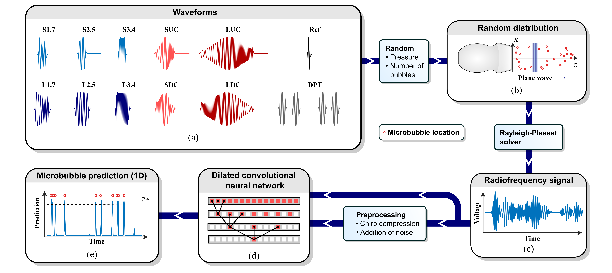

# Waveform-specific performance of deep learning-based ultrasound super resolution models

This repository contains the code for the study of: R. Zorgdrager, N. Blanken, J. M. Wolterink, M. Versluis and G. Lajoinie, "Waveform-Specific Performance of Deep Learning-Based Ultrasound Super-Resolution Models", in prepraration for the spotlight issue *Breaking the Resolution Barrier in Ultrasound* of IEEE Transactions on Ultrasonics, Ferroelectrics, and Frequency Control.

The code here is based on a clone of https://github.com/MIAGroupUT/SRML-1D.

**Fig. 1** **Methods overview.** **1** *A random distribution of microbubbles is stimulated with the selected pulse using a virtual P4-1 transducer. The simulator computes the local shapes of the pressure wave by accounting for nonlinear propagation in the medium and solves the RP-equation. The received signal by the transducer is used as RF lines for training, validation, and testing.*

The code is organized into three folders:
* 📂 **RF_simulator:** Pulse definition, RF signal simulation, ground truth generation, and optional RF decoding. Section IIA, IIB and, IIC-1 in the article.
* 📂 **Network_pulse_types:** Neural network training and evaluation. Sections IIC-2, IID, IIE-1 in the article.
* 📂 **DelayAndSum:**  Delay-and-sum image reconstruction with unprocessed and deconvolved RF signals. Section IIE-2 in the article.

## Required software

* RF_simulator: MATLAB with Signal Processing Toolbox.
* Network: Python with PyTorch, NumPy, Matplotlib, SciPy
* DelayAndSum: MATLAB with export_fig module.

The datasets used in the project can be found at [SURFdrive](https://surfdrive.surf.nl/files/index.php/s/MkF1txgyJhnKw6W?path=%2FSRML-1D-pulse-types). Here you will also find Python environments required for running the code and the export_fig module for exporting the DAS images in MATLAB.

See also our other project [SRML-1D](https://github.com/MIAGroupUT/SRML-1D).
