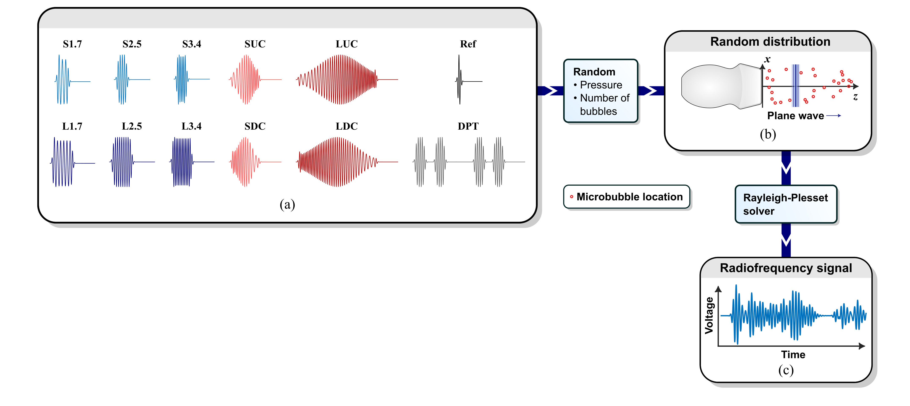

# RF signal simulator

The RF signal simulator is described in detail in Section IIB of the article.

**Fig. 3. RF signal simulator.** *The simulator uses the defined waveforms (a) and stimulates a random distribution of microbubbles with the defined pulses using a virtual P4-1 transducer (b). The simulator computes the local shapes of the pressure wave by accounting for nonlinear propagation in the medium and solves the Rayleigh-Plesset-equation. The received signal (c) by the transducer is used as RF lines for training, validation, and testing.*

## File overview
### Main RF simulator files
* `main.m` RF signal simulator for both 1D and 2D data. It uses microbubbles with a monodisperse size distribution.
* `chirpCompression.m` Decodes the chirps using a linear kernel.
* `get_pulse_properties.m` Definitions of the transmit pulses.
* `plotPulses.m` Visualizes the defined transmit pulses.
* `VariablesList.m`	Overview of simulation parameters and variables.
* `writeResultsToTxt.m`	Convert RF simulation results to .txt files for network training, validation, and testing.

### Folders:
* 📂 `extra_files`	Plot transfer functions, estimate resonance radius microbubble.
* 📂 `functions` Functions used in the RF simulator.
* 📂 `microbubble-simulator` Simulator module with parallelized RP solver.
